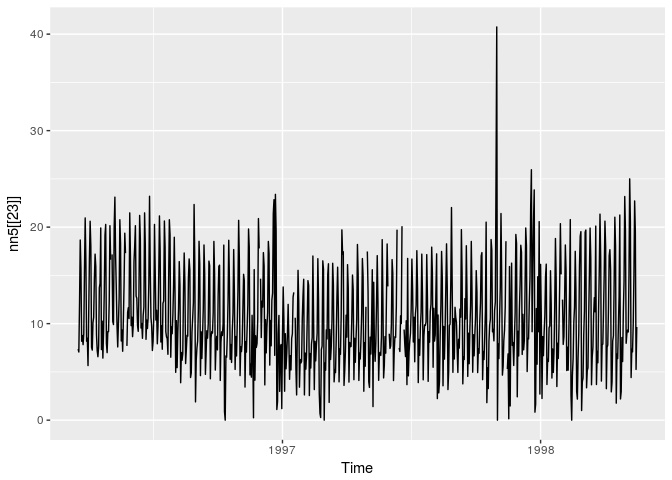

<!-- README.md is generated from README.Rmd. Please edit that file -->
tscompdata
==========

[](https://github.com/robjhyndman/tscompdata/pulls)

The R package *tscompdata* provides time series data from the following forecasting competitions: M, M3, NN3, NN5, NNGC1, Tourism, GEFCom2012, GEFCom2014 and GEFCom2017, along with some tools for plotting the data.

The M, M3 and Tourism data are loaded from the Mcomp and Tcomp packages. The remaining data are contained within the tscompdata package.

Installation
------------

You can install the **development** version from [Github](https://github.com/robjhyndman/tscompdata) with:

``` r
# install.packages("devtools")
devtools::install_github("robjhyndman/tscompdata")
```

Usage
-----

``` r
library(tscompdata)
#> Loading required package: Mcomp
#> Loading required package: forecast
#> Loading required package: Tcomp
library(forecast)
library(ggplot2)
autoplot(nn5[[23]])
```



License
-------

This package is free and open source software, licensed under GPL-3.
